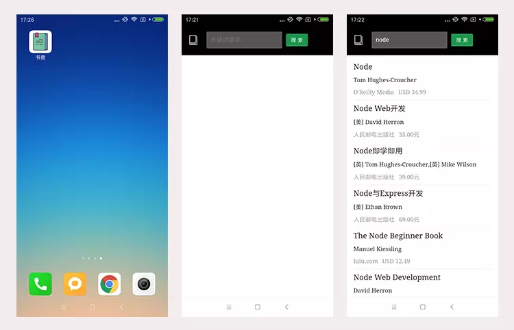
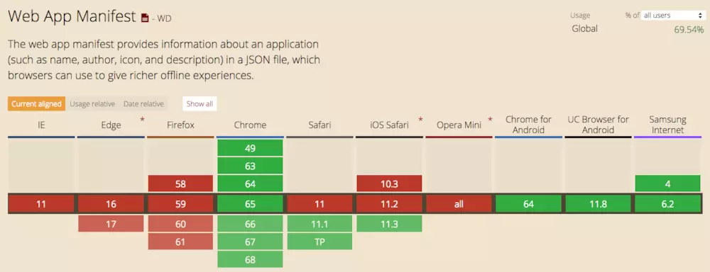
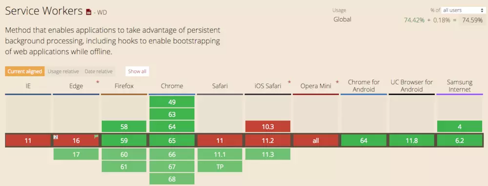
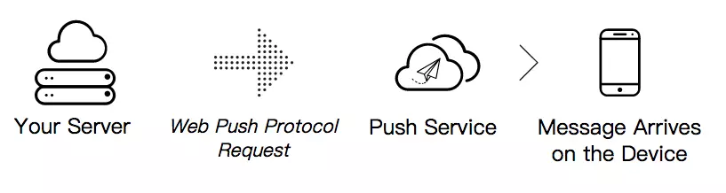
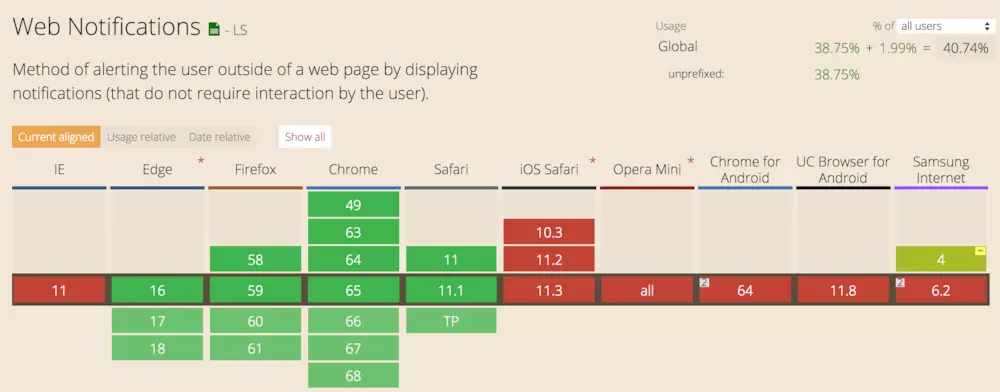

# 什么是PWA
PWA是Progressive Web App的英文缩写， 翻译过来就是渐进式增强WEB应用， 是Google 在2016年提出的概念，2017年落地的web技术。目的就是在移动端利用提供的标准化框架，在网页应用中实现和原生应用相近的用户体验的渐进式网页应用。

PWA 能做到原生应用的体验不是靠特指某一项技术，而是经过应用一些新技术进行改进，在安全、性能和体验三个方面都有很大提升，PWA 本质上是 Web App，借助一些新技术也具备了 Native App 的一些特性，兼具 Web App 和 Native App 的优点。
PWA 的主要特点包括下面三点：
* 可靠 - 即使在不稳定的网络环境下，也能瞬间加载并展现
* 体验 - 快速响应，并且有平滑的动画响应用户的操作
* 粘性 - 像设备上的原生应用，具有沉浸式的用户体验，用户可以添加到桌面
PWA 本身强调渐进式，并不要求一次性达到安全、性能和体验上的所有要求，开发者可以通过 [PWA Checklist](https://developers.google.cn/web/progressive-web-apps/checklist) 查看现有的特征。

# 可靠
当用户打开我们站点时（从桌面 icon 或者从浏览器），通过 [Service Worker](https://developers.google.cn/web/fundamentals/primers/service-workers/) 能够让用户在网络条件很差的情况下也能瞬间加载并且展现。

Service Worker 是用 JavaScript 编写的 JS 文件，能够代理请求，并且能够操作浏览器缓存，通过将缓存的内容直接返回，让请求能够瞬间完成。开发者可以预存储关键文件，可以淘汰过期的文件等等，给用户提供可靠的体验。
# 体验
如果站点加载时间超过 3s，53% 的用户会放弃等待。页面展现之后，用户期望有平滑的体验，过渡动画和快速响应。

为了保证首屏的加载，我们需要从设计上考虑，在内容请求完成之前，可以优先保证 App Shell 的渲染，做到和 Native App 一样的体验，[App Shell](https://developers.google.cn/web/fundamentals/architecture/app-shell) 是 PWA 界面展现所需的最小资源。
# 粘性
* PWA 是可以安装的，用户点击安装到桌面后，会在桌面创建一个 PWA 应用，并且不需要从应用商店下载

* PWA 可以借助 Web App Manifest 提供给用户和 Native App 一样的沉浸式体验

* PWA 可以通过给用户发送离线通知，让用户回流
Web App Manifest 允许开发者控制 PWA 添加到桌面，允许定制桌面图标、URL等等。
# 其他
上面讲到 PWA 是兼具 Web App 和 Native App 的特征的，Web App 无版本问题、可索引也是很重要的特性。

总结，PWA 具有下面一些特性：
* **渐进式** - 适用于所有浏览器，因为它是以渐进式增强作为宗旨开发的
* **连接无关性** - 能够借助 Service Worker 在离线或者网络较差的情况下正常访问
* **类似应用** - 由于是在 App Shell 模型基础上开发，因为应具有 Native App 的交互和导航，给用户 Native App 的体验
* **持续更新** - 始终是最新的，无版本和更新问题
* **安全** - 通过 HTTPS 协议提供服务，防止窥探和确保内容不被篡改
* **可索引** - 应用清单文件和 Service Worker 可以让搜索引擎索引到，从而将其识别为『应用』
* **粘性** - 通过推送离线通知等，可以让用户回流
* **可安装** - 用户可以添加常用的 webapp 到桌面，免去去应用商店下载的麻烦
* **可链接** - 通过链接即可分享内容，无需下载安装
PWA 是对站点体验的一个飞跃式的提升，我们会从安全、性能和体验三个角度来分析如何打造一个完善的 PWA。

# PWA与原生的对比
### 优势
1. 无需安装，无需下载，只要你输入网址访问一次，然后将其添加到设备桌面就可以持续使用。
2. 发布不需要提交到app商店审核
3. 更新迭代版本不需要审核，不需要重新发布审核
4. 现有的web网页都能通过改进成为PWA， 能很快的转型，上线，实现业务、获取流量
5. 不需要开发Android和IOS两套不同的版本
### 劣势
1. 游览器对技术支持还不够全面， 不是每一款游览器都能100%的支持所有PWA
2. 需要通过第三方库才能调用底层硬件（如摄像头）
3. PWA现在还没那么火，国内一些手机生产上在Android系统上做了手脚，似乎屏蔽了PWA, 但是相信当PWA火起来以后，这个问题就不会是问题

# PWA中的一些技术

## 1. Web App Mainfest
  * Manifest 的目的是将Web应用程序安装到设备的主屏幕，为用户提供更快的访问和更丰富的体验。
  * Manifest是一个JSON格式的文件，一个指定了Web App桌面图标、名称、开屏图标、运行模式等一系列资源的一个清单。
   ```
   <!-- 在index.html中添加以下meta标签 -->
   <link rel="manifest" href="/manifest.json">
   ```
   
   * 浏览器兼容
   
   
   ```
   {
    "name": "图书搜索",
    "short_name": "书查",
    "start_url": "/",
    "display": "standalone",
    "background_color": "#333",
    "description": "一个搜索图书的小WebAPP（基于豆瓣开放接口）",
    "orientation": "portrait-primary",
    "theme_color": "#5eace0",
    "icons": [{
        "src": "img/icons/book-32.png",
        "sizes": "32x32",
        "type": "image/png"
    }, {
        "src": "img/icons/book-72.png",
        "sizes": "72x72",
        "type": "image/png"
    }, {
        "src": "img/icons/book-128.png",
        "sizes": "128x128",
        "type": "image/png"
    }, {
        "src": "img/icons/book-144.png",
        "sizes": "144x144",
        "type": "image/png"
    }, {
        "src": "img/icons/book-192.png",
        "sizes": "192x192",
        "type": "image/png"
    }, {
        "src": "img/icons/book-256.png",
        "sizes": "256x256",
        "type": "image/png"
    }, {
        "src": "img/icons/book-512.png",
        "sizes": "512x512",
        "type": "image/png"
    }]
}
   ```
   ### 1.name, short_name
   指定了Web App的名称。short_name其实是该应用的一个简称。一般来说，当没有足够空间展示应用的name时，系统就会使用short_name。可以看到本文的例子中，    图书搜索这个应用在桌面上展示的名称就是short_name书查
   
   ### 2.start_url
   这个属性指定了用户打开该Web App时加载的URL。相对URL会相对于manifest。这里我们指定了start_url为/，访问根目录。
   
   ### 3.display
   display控制了应用的显示模式，它有四个值可以选择：fullscreen、standalone、minimal-ui和browser。
   
   * fullscreen：全屏显示，会尽可能将所有的显示区域都占满；
   * standalone：独立应用模式，这种模式下打开的应用有自己的启动图标，并且不会有浏览器的地址栏。因此看起来更像一个Native App；
   * minimal-ui：与standalone相比，该模式会多出地址栏；
   * browser：一般来说，会和正常使用浏览器打开样式一致。
   
   ### 4.icons， background_color
   定义应用程序的默认主题颜色。 这有时会影响操作系统显示应用程序的方式（例如，在Android的任务切换器上，主题颜色包围应用程序）。此外，还可以在meta标签中设置theme_color：<meta name="theme-color" content="#5eace0"/>
   
### safari,ie
safari与ie中，可以通过一些特有的meta、link标签来实现
* safari
```
<meta name="apple-mobile-web-app-capable" content="yes">
<meta name="apple-mobile-web-app-status-bar-style" content="default">
<meta name="apple-mobile-web-app-title" content="图书搜索">
<link rel="apple-touch-icon" href="img/icons/book-256.png">
```

* ie
```
<meta name="application-name" content="图书搜索" />
<meta name="msapplication-TileColor" content="#222">
<meta name="msapplication-square70x70logo" content="img/icons/book-72.png" />
<meta name="msapplication-square150x150logo" content="img/icons/book-144.png" />
<meta name="msapplication-square310x310logo" content="img/icons/book-256.png" />
```

## 2. Service Worker
可以把Service Worker简单理解为一个独立于前端页面，在后台运行的进程。因此，它不会阻塞浏览器脚本的运行，同时也无法直接访问浏览器相关的API（例如：DOM、localStorage等）。Service Worker 最主要的特点是：在页面中注册并安装成功后，运行于浏览器后台，不受页面刷新的影响，可以监听和截拦作用域范围内所有页面的 HTTP 请求。基于 Service Worker API 的特性，结合 Fetch API、Cache API、Push API、postMessage API 和 Notification API，可以在基于浏览器的 web 应用中实现如离线缓存、消息推送、静默更新等 native 应用常见的功能，以给 web 应用提供更好更丰富的使用体验

### 特性
  * 一个独立于前端页面，在后台运行的进程。
  * 让我们的Web App在无网（offline）情况下可以访问，甚至使用部分功能，而不是展示“无网络连接”的错误页。
  * 让我们在弱网的情况下，能使用缓存快速访问我们的应用，提升体验。
  * 在正常的网络情况下，也可以通过各种自发控制的缓存方式来节省部分请求带宽
  * 浏览器兼容
   
   
### 主要原理
你可以在Service Worker中监听所有客户端（Web）发出的请求，然后通过Service Worker来代理，向后端服务发起请求。通过监听用户请求信息，Service Worker可以决定是否使用缓存来作为Web请求的返回。

## 3. Push & Notification 推送与通知
  * 可以通过这两个API推送消息
  * 浏览器可以向push server发起订阅，订阅后将订阅信息发送给服务端，服务端根据Web Push 协议通知Push Service, Push Server 效验后推送给已订阅的客户端
   
  * 浏览器兼容
   
   
### service 是如何离线可用的？

### Service Worker和HTTP缓存
1、改写默认行为。
例如，浏览器默认在刷新时，会对所有资源都重新发起请求，即使缓存还是有效期内，而使用了SW，就可以改写这个行为，直接返回缓存。

2、缓存和更新并存。
要让网页离线使用，就需要整站使用长缓存，包括HTML。而HTML使用了长缓存，就无法及时更新（浏览器没有开放接口直接删除某个html缓存）。而使用SW就可以，每次先使用缓存部分，然后再发起SW js的请求，这个请求我们可以实施变更，修改HTML版本，重新缓存一份。那么用户下次打开就可以看到新版本了。

3、无侵入式。
无侵入式版本控制。最优的版本控制，一般是HTML中记录所有js css的文件名（HASH），然后按需发起请求。每个资源都长缓存。而这个过程，就需要改变了项目结构，至少多一个js或者一段js控制版本号，发起请求时还需要url中注入冬天的文件名。使用了SW，就可以把这部分非业务逻辑整合到sw js中。
无侵入式请求统计。例如缓存比例统计、图片404统计。

4、额外缓存。
HTTP缓存空间有限，容易被冲掉。虽然部分浏览器实现SW的存储也有淘汰机制，但多一层缓存，命中的概率就要更高了

5、离线处理。
当监测到离线，而且又没有缓存某个图片时，可以做特殊处理，返回离线的提示。又或者做一个纯前端的404/断网页面。类似Chrome的小恐龙页面。

# 参考
[lavas](https://lavas.baidu.com/pwa/README)

[Service Worker 应用详解](https://lzw.me/a/pwa-service-worker.html)

[pwa demo](https://www.jianshu.com/p/098af61bbe04)
